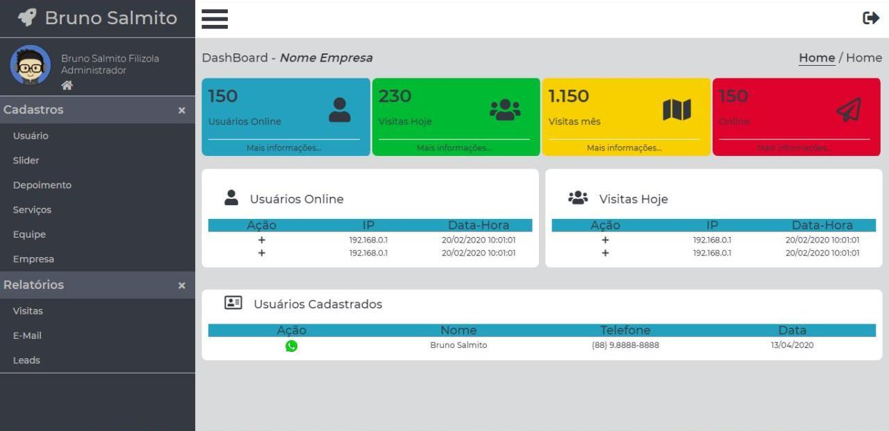

# Website - Projeto Pessoal
> Website desenvolvido para estudo
[![NPM Version][npm-image]][npm-url]
[![Build Status][travis-image]][travis-url]
[![Downloads Stats][npm-downloads]][npm-url]

>Website pessoal, single page que foi desenvolvido para fins de estudo das linguagens `[JavaScript]`,`[PHP]`,`[HTML]` e `[CSS]`.
> Versão: 1.0

## Arquivos site principal
🚀 __*JS*__ -> Na pasta `js` estão localizados todos os scripts do site principal.
1. *js/animate.js* => Script que controla as animações da página.
2. *js/maps.js* => Script para adição do Google Maps.
3. *js/mask.js* => Script que adiciona uma mascará aos formulários
4. *js/menu.js* => Script que controla o menu mobile
5. *js/scrollMenu.js* => Script que adiciona um efeito ao header do site.
6. *js/ajax.js* => Pega os dados do formulário e passa via ajax para o arquivo `ajax/formSend.php`;

🚀 __*CSS*__ -> Na pasta `css` estão localizados todos os arquivos de css do site principal
1. *css/all.css* => Arquivo de estilo do fontawsome
2. *css/style.css* => Arquivo de estilização do site principal

🚀 __*PHP*__ -> Nas pastas class, e na raiz deste projeto encontra-se os arquivos necessários para controle do backend do site e 
dashboard
1. *config.php* => Contém as variáveis globais e configurações gerais
2. *class/Guest.php* => Classe que contém os métodos para registrar os usuários online e o livro de visitas
3. *class/Mysql.php* => Classe que contém os métodos para conectar ao banco de dados.
4. *class/Email.php* => Classe que trata, adiciona e envia os e-mail`s.
5. *ajax/formSend.php* => Envia os dados recebidos via ajax para o e-mail.

> Configuração-> Para usar este projeto você precisa alterar o arquivo `config.php` e alterar/incluir
> as variáveis `INCLUDE_PATH`, `INCLUDE_PATH_PANEL`, variáveis ref. ao acesso ao Banco de dados.
1.  __INCLUDE_PATH__ => Variável com o caminho do diretório principal do site.
2.  __INCLUDE_PATH_PANEL__ => Variável com o caminho do diretório do painel de controle.
3.  __DSN__ => Tipo do banco de dados que você esta utilizando.
4.  __DBNAME__ => Nome do banco de dados.
5.  __USERDB__ => Usuário do banco de dados.
6.  __PASSDB__ => Senha do banco de dados.

~~~php
#Config.php
# Variáveis globais
define('INCLUDE_PATH', 'http://localhost/danki/back-end/projeto_01.2/');
define('INCLUDE_PATH_PANEL', INCLUDE_PATH . 'painel/');

# Definições do banco de dados
define('DSN', 'mysql:host=localhost;');
define('DBNAME', 'dbname=website');
define('USERDB', 'root');
define('PASSDB', '');
define('ERRORDB', '');
~~~

> Classe para controlar o acesso ao banco de dados.
~~~php
#class/Mysql.php
class Mysql
{
    private static $pdo;

    public static function connect()
    {
        if (self::$pdo == null) {
            //Caso ainda não tenha sido instanciada
            try {
                self::$pdo = new PDO(DSN . DBNAME, USERDB, PASSDB, array(PDO::MYSQL_ATTR_INIT_COMMAND => "SET NAMES utf8"));
                self::$pdo->setAttribute(PDO::ATTR_ERRMODE, PDO::ERRMODE_EXCEPTION);
            } catch (Exception $e) {
                // Algo de errado aconteceu
                echo '<h2>Erro ao conectar</h2>';
            }
        }
        return self::$pdo;
    } //Fim do connect
}//fim Mysql
~~~

> Define o comportamento das animações do site principal
~~~css
/* --------------------------------------------------
*    Animações
*    Para usar as animações basta colocar na tag o
*    Atributo data-anime
*    css/style.css
*/
[data-anime] {
    opacity: 0;
    transition: all .8s ease;
}

[data-anime="left"] {
    transform: translate3d(-50px, 0, 0);
}

[data-anime="right"] {
    transform: translate3d(50px, 0, 0);
}

[data-anime="top"] {
    transform: translate3d(0, -50px, 0);
}

[data-anime="bottom"] {
    transform: translate3d(0, 50px, 0);
}

[data-anime].animate {
    opacity: 1;
    transform: translate3d(0, 0, 0);
}
~~~

> Controla o scroll e animações setadas no css do site principal
~~~javascript
/**
 * Função animeScroll 
 * Quando o usuário declarar o attributo data-anime ativa o scroll
 * quando fizer o scroll executa as animações com o atributo
 */
const target = document.querySelectorAll('[data-anime]');

function animeScroll() {
    const windowTop = window.pageYOffset + ((window.innerHeight * 3) / 4);
    const bannerTop = window.innerHeight;

    target.forEach(function (element) {
        if ((windowTop) > element.offsetTop) {
            //Adiciona a classe que controla a animação
            element.classList.add('animate');
        } else {
            //Remove a classe que controla a animação
            element.classList.remove('animate');
        }
    })

} // Fim da function animeScroll
~~~

## Próximas implatações

- [ ] Website.
- [x] Menu.
    - [x] Menu site.
    - [x] Menu mobile.
- [x] Section Call.
- [x] Section Services.
- [x] Section Team.
- [x] Section Testimony.
- [x] Section Contact and Map.
- [ ] Page Error.
- [x] Animate.
- [x] Mask Form.
- [x] Google Maps.
- [x] Loader send form.
- [x] Warning msg send.

- [ ] Dashboard.
    - [x] Asside - Header - Content.
    - [x] Menu and pages.
    - [ ] Page Error.
    - [ ] Animate login page.
    
#### Back-End 
- [ ] Website.
- [x] Friendly URLs.
- [x] `config.php`.
- [ ] Load Page and 404 error.
- [ ] Forget Password.
- [ ] Send form E-mail.
    - [ ] PHPMayler.
    - [ ] Class E-mail.
    - [ ] Ajax form.
    - [ ] Error/Success box.
- [x] Class Guest.
    - [x] + `guestOnline()`.
    - [x] + `visitor()`.
    - [x] + `detectMobile()`.    

- [ ] Dashboard.
- [ ] Mysql class.
- [ ] Painel class.
    - [ ] + `login()`.
    - [ ] + `loadPage()`.
    - [ ] + `permission()`.
    - [ ] + `getGroup()`.
    - [ ] + `warning()`.
    - [ ] + `logFile()`.

- [ ] User class.
    - [ ] + `addUser()`.
    - [ ] + `updateUser()`.
    - [ ] + `deleteUser()`.

- [ ] Company class.

     
## Configuração para Desenvolvimento

Basta clonar ou fazer o *download* do repositório e mexer à vontade.

## Histórico de lançamentos
* 0.0.8
    * ADIÇÃO: Adicionado do Loader durante o envio do formulário `CSS`.
    * ADIÇÃO: Adicionado o arquivo `ajax/formSend.php` para enviar e-mail do formulário.
    * ADIÇÃO: Adicionado o script `js/ajax.js` para controlar o envio via ajax(Json) dos formulários no site principal.
    * MUDANÇA: Alterado a cor no `CSS` dos warnings msg.
* 0.0.7
    * ADIÇÃO: Adicionado controle de visitantes e contador de visitas através da classe Guest.
    * ADIÇÃO: Controle de conexão ao banco de dados através da classe Mysql.php.
    * MUDANÇA: Adicionado no `index.php` as chamadas para os métodos na classe Guest.
* 0.0.6
    * ADIÇÃO: Adicionado suporte a url`s amigáveis.
    * ADIÇÃO: Adicionado o PHPMailer/=.
    * ADIÇÃO: Adicionado config.php.
* 0.0.5
    * MUDANÇA: Correção do CSS (*dashboard*)
    * ADIÇÃO: Adicionadas as páginas de cadastro e edição de usuários
* 0.0.4
    * ADIÇÃO: Adicionado o *main* do *dashboard* (não finalizado)
* 0.0.3
    * MUDANÇA: Correção do arquivo `README.md`
    * ADIÇÃO: *Scripts* animate, maps, mask ao *site* principal
* 0.0.2
    * MUDANÇA: Correção do CSS.
* 0.0.1
    * Desenvolvimento *Front-End*

## Meta

Bruno Salmito – [@bruno.salmito.5](https://web.facebook.com/bruno.salmito.5) – brunosalmito@gmail.com

Distribuído sob a licença MIT. Veja `LICENSE` para mais informações.

[https://github.com/bruno-salmito/github-link](https://github.com/bruno-salmito/)

## Contributing

1. Faça o _fork_ do projeto (<https://github.com/bruno-salmito/WebSite/fork>)
2. Crie uma _branch_ para sua modificação (`git checkout -b feature/fooBar`)
3. Faça o _commit_ (`git commit -am 'Add some fooBar'`)
4. _Push_ (`git push origin feature/fooBar`)
5. Crie um novo _Pull Request_

[npm-image]: https://img.shields.io/npm/v/datadog-metrics.svg?style=flat-square
[npm-url]: https://npmjs.org/package/datadog-metrics
[npm-downloads]: https://img.shields.io/npm/dm/datadog-metrics.svg?style=flat-square
[travis-image]: https://img.shields.io/travis/dbader/node-datadog-metrics/master.svg?style=flat-square
[travis-url]: https://travis-ci.org/dbader/node-datadog-metrics
[wiki]: https://github.com/seunome/WebSite/wiki
